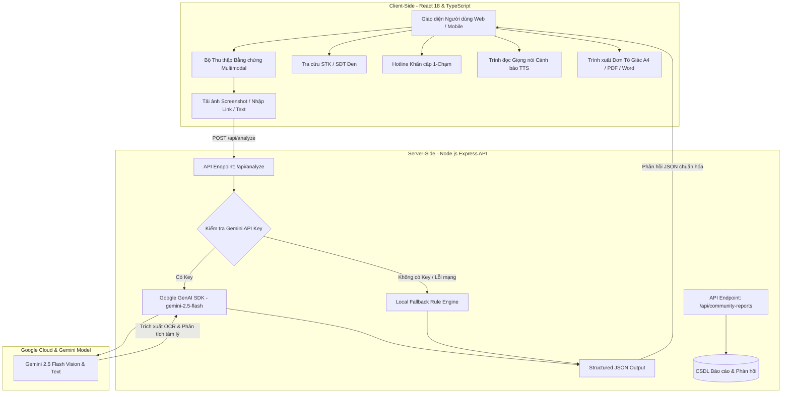

# 🛡️ ShieldAI Vietnam — Nền Tảng Giám Định & Phòng Chống Lừa Đảo Trực Tuyến Đa Phương Thức

[](https://aistudio.google.com/)
[](https://reactjs.org/)
[](https://tailwindcss.com/)
[](https://expressjs.com/)
[](LICENSE)

> **Dự án tham dự cuộc thi AIRiserVietnam (#BuildwithGoogleAI)**  
> *Giải pháp Trí tuệ Nhân tạo Đa phương thức bảo vệ người dân và không gian mạng Việt Nam trước vấn nạn lừa đảo công nghệ cao.*

---

## 📌 1. Tổng Quan Dự Án (Executive Summary)

Trong bối cảnh tội phạm lừa đảo trực tuyến tại Việt Nam ngày càng tinh vi với các thủ đoạn như **Fake Bill chuyển khoản, giả mạo SMS Brandname ngân hàng, Deepfake, bẫy CTV online, giả danh Công an/Thuế/VNeID**, người dân (đặc biệt là người cao tuổi và lao động phổ thông) đối mặt với rủi ro mất mát tài sản rất lớn.

**ShieldAI Vietnam** được xây dựng như một "lá chắn số" toàn diện, kết hợp giữa mô hình ngôn ngữ lớn đa phương thức **Google Gemini 2.5 Flash** và **Bộ quy tắc chuyên gia an ninh mạng nội địa**. Nền tảng cho phép người dùng giám định chứng cứ số, tra cứu danh bạ đen, nghe cảnh báo bằng giọng nói và xuất hồ sơ tố giác tội phạm chuẩn A4 gửi cơ quan chức năng chỉ trong vài giây.

---

## 🌟 2. Hệ Thống Tính Năng Toàn Diện (Key Features)

### 2.1. Giám Định Đa Phương Thức Thông Minh (Multimodal AI Analysis)
- **Phân tích Bằng chứng Kép**: Hỗ trợ đồng thời tải ảnh chụp màn hình (SMS, Zalo, Telegram, Hóa đơn ngân hàng, mã QR) kết hợp với văn bản trao đổi hoặc đường link (URL) nghi vấn.
- **Thẻ Điểm Rủi Ro Độc Quyền (Risk Score 0–100)**: Tự động phân cấp rủi ro thành 4 mức: `AN TOÀN`, `TRUNG BÌNH`, `CAO`, và `CỰC KỲ NGUY HIỂM`.
- **Bóc Tách Chiêu Trò Tâm Lý (Psychology Deconstruction)**: Chỉ rõ thủ đoạn đe dọa pháp lý, bẫy lòng tham, tạo áp lực thời gian gấp rút hoặc thao túng lòng tin.
- **Cơ Chế Dự Phòng Nội Bộ (Offline/Local Engine)**: Tự động kích hoạt bộ quy tắc phân tích chuyên sâu khi mất kết nối mạng hoặc không có API Key, đảm bảo hệ thống luôn luôn sẵn sàng phục vụ 24/7.

### 2.2. Tra Cứu Danh Bạ Đen & Cảnh Báo Cộng Đồng (Blacklist Lookup & Flagging)
- Tra cứu tức thì số tài khoản ngân hàng (Vietcombank, MB Bank, Techcombank, BIDV, Agribank...), số điện thoại lừa đảo (đầu số 024, 028 mạo danh...) và tên miền độc hại giả mạo cổng dịch vụ công.
- Cho phép người dùng gắn cờ báo cáo đối tượng mới vào cơ sở dữ liệu để cảnh báo cộng đồng.

### 2.3. Tổng Đài Khẩn Cấp 1-Chạm (Emergency Hotlines 24/7)
- Tích hợp quay số nhanh tới **Tổng đài Quốc gia 156 / 5656** (Cục An toàn Thông tin - Bộ TT&TT), Cục An ninh mạng **A05 (Bộ Công an)** và **113**.
- Danh bạ Hotline hỗ trợ **khóa tài khoản & khóa thẻ khẩn cấp** của toàn bộ các ngân hàng thương mại tại Việt Nam.

### 2.4. Đọc To Cảnh Báo Bằng Giọng Nói (Text-to-Speech Accessibility)
- Tích hợp công nghệ giọng đọc tiếng Việt rõ ràng, mạch lạc, tóm tắt ngắn gọn loại hình lừa đảo và các bước cần làm ngay — tối ưu cho **người cao tuổi, người khiếm thị hoặc người dùng không quen đọc văn bản dài**.

### 2.5. Xuất Đơn Tố Giác & Phiếu Bằng Chứng Chuẩn Pháp Lý (A4 / PDF / Word)
- Tự động điền dữ liệu bóc tách từ bằng chứng vào mẫu **Đơn Trình Báo & Tố Giác Tội Phạm** chuẩn thể thức theo **Điều 174 & Điều 290 Bộ luật Hình sự** và **Luật An ninh mạng 2018**.
- Hỗ trợ **In ấn & Lưu PDF trực tiếp (chuẩn khổ A4)**, tải file **Microsoft Word (.doc)** để chỉnh sửa hoặc sao chép văn bản gửi trực tiếp cho cơ quan Công an.

---

## 🏗️ 3. Kiến Trúc Hệ Thống (System Architecture)



---

## 💻 4. Công Nghệ Sử Dụng (Tech Stack)

| Thành phần | Công nghệ / Thư viện | Vai trò |
| :--- | :--- | :--- |
| **Frontend** | React 18, TypeScript, Tailwind CSS, Vite | Giao diện hiện đại, tối ưu di động, hiển thị thời gian thực |
| **Icons & UI** | Lucide React, Headless UI Patterns | Hệ thống biểu tượng trực quan, chuẩn trợ năng |
| **Backend API** | Node.js, Express, `tsx`, `esbuild` | Proxy API bảo mật, xử lý upload dữ liệu và CORS |
| **Trí tuệ nhân tạo**| `@google/genai` (Gemini 2.5 Flash) | Xử lý đa phương thức, trích xuất thực thể, Structured JSON |
| **Giọng nói** | Web Speech Synthesis API (vi-VN) | Đọc cảnh báo hỗ trợ người cao tuổi và người yếu thế |
| **Tài liệu số** | CSS `@media print` A4, Word Blob Export | Xuất đơn tố giác pháp lý chuẩn xác |

---

## 🚀 5. Hướng Dẫn Cài Đặt & Chạy Môi Trường Cục Bộ (Local Setup)

### Yêu cầu hệ thống:
- **Node.js**: Phiên bản `>= 18.0.0`
- **npm** hoặc **yarn**
- **Gemini API Key** (Tùy chọn — lấy miễn phí tại [Google AI Studio](https://aistudio.google.com/))

### Các bước thực hiện:

1. **Clone repository về máy**:
   ```bash
   git clone https://github.com/your-username/shieldai-vietnam.git
   cd shieldai-vietnam
   ```

2. **Cài đặt các gói phụ thuộc**:
   ```bash
   npm install
   ```

3. **Cấu hình biến môi trường**:
   Sao chép tệp mẫu và cấu hình API Key của bạn:
   ```bash
   cp .env.example .env
   ```
   *Mở `.env` và điền khóa API:*
   ```env
   GEMINI_API_KEY=AIzaSyYourGeminiApiKeyHere
   PORT=3000
   ```
   *(Lưu ý: Nếu không có API Key, hệ thống sẽ tự động chuyển sang chế độ Local Rule Engine mà không làm gián đoạn trải nghiệm).*

4. **Khởi chạy ứng dụng**:
   ```bash
   npm run dev
   ```
   Truy cập vào trình duyệt tại địa chỉ: `http://localhost:3000`

---

## ☁️ 6. Hướng Dẫn Triển Khai Lên Google Cloud Run

ShieldAI Vietnam được đóng gói chuẩn Node.js production server, sẵn sàng deploy lên **Google Cloud Run**:

```bash
# 1. Build project thành file tĩnh và bundle server CJS
npm run build

# 2. Build Container Image với Google Cloud Build
gcloud builds submit --tag gcr.io/YOUR_PROJECT_ID/shieldai-vietnam:latest

# 3. Triển khai lên Google Cloud Run
gcloud run deploy shieldai-vietnam \
  --image gcr.io/YOUR_PROJECT_ID/shieldai-vietnam:latest \
  --platform managed \
  --region asia-southeast1 \
  --allow-unauthenticated \
  --port 3000 \
  --set-env-vars GEMINI_API_KEY="YOUR_GEMINI_API_KEY"
```

---

## 🔒 7. Quyền Riêng Tư & An Toàn Dữ Liệu (Privacy & Security)

- **Bảo mật API Key**: Toàn bộ yêu cầu gọi tới Gemini API được thực hiện từ máy chủ backend (`server.ts`), tuyệt đối không để lộ API Key trên trình duyệt người dùng.
- **Bảo vệ Dữ liệu Nhạy cảm**: Dữ liệu hình ảnh và thông tin cá nhân của người dùng chỉ được xử lý trong bộ nhớ phiên làm việc, không lưu trữ vĩnh viễn hình ảnh nhạy cảm khi chưa có sự đồng ý.
- **Tiêu chuẩn Pháp lý**: Các mẫu đơn và hướng dẫn tuân thủ đúng quy định của pháp luật Việt Nam hiện hành.

---

## 🤝 8. Đóng Góp & Liên Hệ (Contribution & Community)

Mọi ý kiến đóng góp, báo cáo lỗi hoặc đề xuất tính năng mới cho dự án xin vui lòng tạo **Issue** hoặc gửi **Pull Request**.

- **Email**: vodainhatan@gmail.com
- **Dự án**: AIRiserVietnam (#BuildwithGoogleAI)
- **Tác giả**: Đội ngũ phát triển ShieldAI Vietnam

---

*© 2025–2026 ShieldAI Vietnam. Chung tay vì một không gian mạng Việt Nam an toàn, văn minh và tin cậy.*
