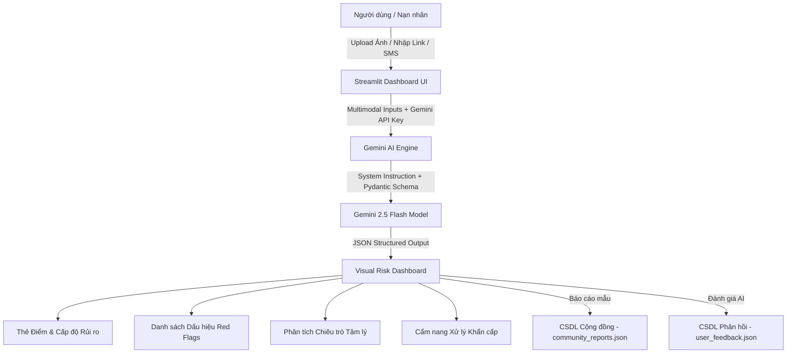

# 🛡️ ShieldAI Vietnam — Hệ thống Phòng chống Lừa đảo Trực tuyến Đa phương thức

> **Dự án tham dự cuộc thi AIRiserVietnam (#BuildwithGoogleAI)**
> *Được phát triển bởi Senior AI Engineer & Full-stack Developer*

ShieldAI Vietnam là ứng dụng Web đa phương thức (Multimodal Web App) giúp phát hiện, phân tích rủi ro và ngăn chặn các hình thức lừa đảo trực tuyến (Scam & Fraud) tại Việt Nam bằng việc ứng dụng **Google Gemini API** với **Structured Outputs (Pydantic Schema)** và giao diện **Streamlit Dashboard** hiện đại.

---

## 🌟 Tính năng Nổi bật

1. **Phân tích Đa phương thức (Multimodal Input)**:

   - 📷 **Ảnh chụp màn hình**: Tải lên ảnh tin nhắn SMS, Zalo, Telegram, hóa đơn chuyển tiền nghi giả mạo (Fake Bill), mã QR nghi vấn.
   - 📝 **Văn bản & Link**: Nhập đoạn văn bản chat, email đe dọa, hoặc đường link (URL) website nghi lừa đảo.
2. **Lõi AI Gemini với Structured Outputs**:

   - Sử dụng **Google Gemini API** (`google-genai` SDK) với System Instruction định vị là **Chuyên gia An ninh mạng hàng đầu Việt Nam**.
   - Bắt buộc chuẩn hóa đầu ra JSON (Structured Output):
     - `risk_score`: Thẻ điểm rủi ro từ 0 - 100.
     - `risk_level`: AN TOÀN | TRUNG BÌNH | CAO | CỰC KỲ NGUY HIỂM.
     - `scam_type`: Loại hình lừa đảo nhận diện (Fake Bill, Giả danh Công an/Thuế, Bẫy CTV, QR Độc hại...).
     - `red_flags`: Danh sách các dấu hiệu vi phạm/bất thường.
     - `psychological_tricks`: Thủ thuật thao túng tâm lý (Tạo áp lực thời gian, đe dọa, đánh vào lòng tham...).
     - `advice`: Phân tích chuyên sâu và giải thích chi tiết.
     - `suggested_actions`: Cẩm nang ứng phó khẩn cấp.
3. **Cộng đồng & User Traction (Traction Features)**:

   - 📢 **Nút báo cáo CSDL cộng đồng**: Lưu mẫu lừa đảo nghi vấn vào hệ thống cảnh báo chung (`community_reports.json`).
   - ⭐ **Nút đánh giá độ chính xác**: Thu thập phản hồi thực tế từ người dùng (`user_feedback.json`) nhằm liên tục nâng cao độ chính xác.
4. **Sẵn sàng Triển khai Cloud Run**:

   - Tối ưu hóa Dockerfile với `python:3.11-slim`, cấu hình chạy trên port `8080`, tắt CORS và tự động bind `0.0.0.0`.

---

## 🏗️ Kiến trúc Hệ thống



---

## 📁 Cấu trúc Thư mục Dự án

```
AI_RISER/
├── app.py                  # Streamlit application chính (UI & AI Logic)
├── requirements.txt        # Thư viện phụ thuộc (streamlit, google-genai, pillow, pydantic, python-dotenv)
├── Dockerfile              # Dockerfile tối ưu hóa cho Google Cloud Run (Port 8080)
├── .env.example            # Tệp mẫu cấu hình biến môi trường GEMINI_API_KEY
├── community_reports.json  # CSDL lưu trữ báo cáo lừa đảo từ cộng đồng (Tự động sinh)
├── user_feedback.json     # CSDL lưu trữ đánh giá người dùng (Tự động sinh)
└── README.md               # Tài liệu hướng dẫn & Kiến trúc hệ thống
```

---

## 🚀 Hướng dẫn Cài đặt & Chạy Local

### 1. Yêu cầu Tiền đề

- Python >= 3.10
- Gemini API Key (Lấy miễn phí tại: [Google AI Studio](https://aistudio.google.com/app/apikey))

### 2. Các bước Cài đặt

```bash
# Clone hoặc mở thư mục dự án
cd /Users/votan/Documents/AI_RISER

# Tạo môi trường ảo Python (khuyên dùng)
python3 -m venv venv
source venv/bin/activate  # Trên Linux/macOS
# venv\Scripts\activate   # Trên Windows

# Cài đặt các thư viện cần thiết
pip install -r requirements.txt

# Cấu hình API Key
cp .env.example .env
# Chỉnh sửa tệp .env và thay your_gemini_api_key_here bằng API Key của bạn
```

### 3. Khởi chạy Ứng dụng

```bash
streamlit run app.py
```

Ứng dụng sẽ tự động mở tại giao diện trình duyệt: `http://localhost:8501`

---

## ☁️ Hướng dẫn Deploy lên Google Cloud Run

Thực hiện các bước dưới đây để deploy **ShieldAI Vietnam** lên Google Cloud Run nhanh chóng:

### Bước 1: Khởi tạo và Đăng nhập Google Cloud CLI

```bash
# Đăng nhập tài khoản Google Cloud
gcloud auth login

# Thiết lập Project ID của bạn
gcloud config set project YOUR_PROJECT_ID
```

### Bước 2: Build Container Image với Artifact Registry hoặc Cloud Build

```bash
# Bật các service cần thiết
gcloud services enable run.googleapis.com artifactregistry.googleapis.com cloudbuild.googleapis.com

# Build image bằng Cloud Build
gcloud builds submit --tag gcr.io/YOUR_PROJECT_ID/shieldai-vietnam:latest
```

### Bước 3: Deploy lên Google Cloud Run

```bash
gcloud run deploy shieldai-vietnam \
  --image gcr.io/YOUR_PROJECT_ID/shieldai-vietnam:latest \
  --platform managed \
  --region asia-southeast1 \
  --allow-unauthenticated \
  --port 8080 \
  --set-env-vars GEMINI_API_KEY="YOUR_GEMINI_API_KEY"
```

Sau khi chạy xong, lệnh trên sẽ xuất ra URL công khai dạng:
`https://shieldai-vietnam-xxxxx-as.a.run.app`

---

## 🏆 Đóng góp cho AIRiserVietnam #BuildwithGoogleAI

Dự án **ShieldAI Vietnam** thể hiện sức mạnh của Google Gemini API trong việc giải quyết bài toán an sinh xã hội nhức nhối tại Việt Nam, mang lại giải pháp công nghệ trực quan, chính xác và có giá trị thực tiễn cao cho cộng đồng.
